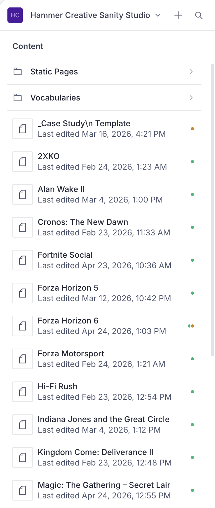
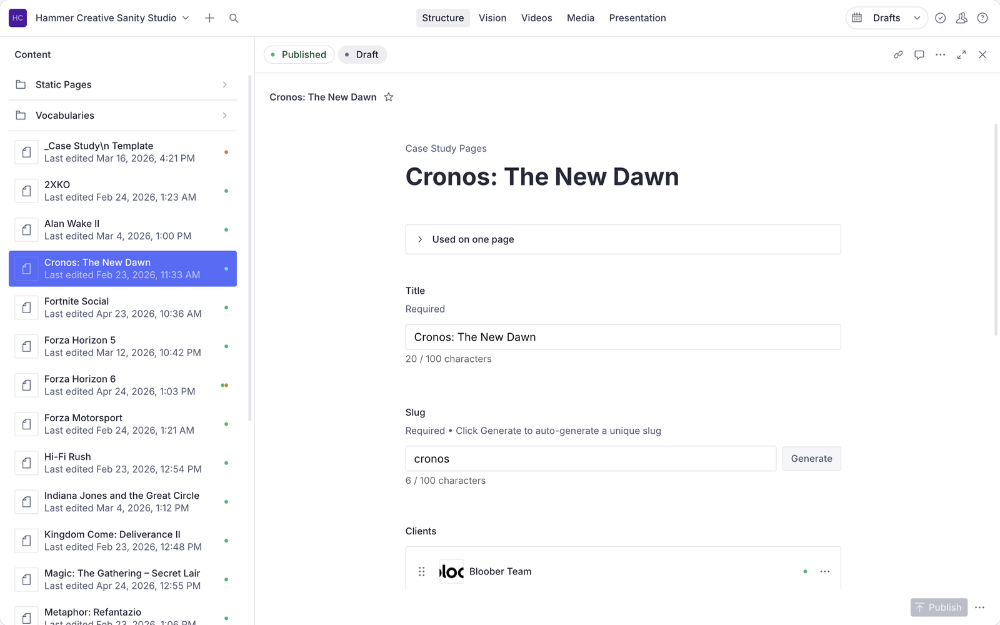
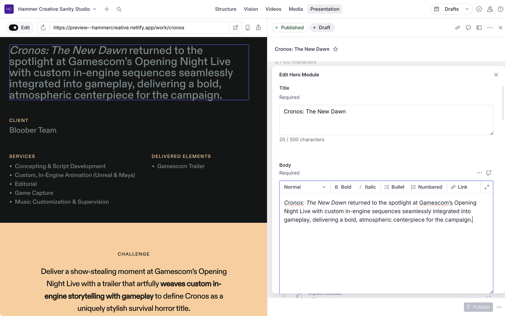

# Editing Case Studies

A step-by-step guide to editing Case Studies on hammercreative.com. Technical notes for developers are at
the bottom.

Last updated 2026-10-09.

### Before you start

- You edit content in the **Studio**: https://hammercreative-cms.sanity.studio
- You check your changes on the **Preview Site**: https://preview--hammercreative.netlify.app
  (this will move to https://preview.hammercreative.com once that address is live).
- The **Preview Site** shows Published work and your Draft work in progress. The **Live Site**,
  hammercreative.com, only shows what is Published.

### Find what you want to edit

In the Studio's left-hand list, from top to bottom:

1. **Static Pages**: the home page (hammercreative.com), /work, /services and /privacy. Open the folder,
   then click the page.
2. **Vocabularies**: the shared lists of Clients, Deliverables and Services.
3. **Case Studies**: one row for each Case Study, in alphabetical order. Under each title, gray text
   shows when it was last edited (Pacific time).

A small dot beside a row tells you its state:

- Green dot: Published

  

- Orange dot: Draft (contains Draft edits that are not Published yet)

  

- Green dot and orange dot: contains Published and Draft content (contains the Published Case Study with Draft edits that are not Published yet)

  

### Edit a Case Study

When you open a Case Study, the tabs at the top of the editor switch between its
Published version and its Draft. Edit on the Draft tab.

1. Open the Studio and click the Case Study you want to change.
2. Make your edit. The Studio saves it automatically as a Draft, and nothing changes on the **Live Site**
   yet.
3. Open the **Preview Site** and go to the same Case Study. Refresh it if you already had it open. You should see
   your change.
4. Happy with it? Go back to the Studio and click **Publish**. It becomes Published, and the **Live Site**
   updates within a minute or so.
5. Not happy with it? Keep editing, or use the document menu in the Studio to discard the Draft.

### Edit with a live preview inside the Studio (Presentation)

**Presentation** shows the **Preview Site** inside the Studio, with the editing form beside it, so you can
click what you want to change and see the result as you type.

1. Open the Studio and click **Presentation** in the top bar.
2. The **Preview Site** loads on the right. Open a Case Study on the site, and the Studio follows along
   and opens that Case Study for editing.
3. Move your mouse over text or images. Anything you can edit gets an outline.
4. Click an outlined item. The editing form opens on that exact field.
5. Type your change. The preview updates as you type. It is saved as a Draft.
6. Click **Publish** when you are happy with it.

**Presentation** always shows Draft work as well as Published work, so what you see is what will go live
once you click Publish.

### Add a new Case Study

1. In the Studio, go to the Case Study list and use the **+** (create) button.
2. Fill in the fields and add the content modules. The first module must be a Hero.
3. Check it on the **Preview Site**, then click **Publish**.
4. The new Case Study appears in the Studio's list after you refresh the page.

### WIP: Jump from the Preview Site to the right field

This works when you open the **Preview Site** on its own in your browser, outside the Studio. It is set
up but has **not been checked on the Preview Site yet**, so treat these steps as what should
happen.

1. Open the **Preview Site** in your browser.
2. Move your mouse over text or images. Anything you can edit should get an outline.
3. Click the outline's **Open in Studio** link. The Studio opens in a new tab on that exact field.
4. Edit it, then follow "Edit a Case Study" above.

If you see no outlines, tell a developer. See "If the outlines don't show up" below.

### FAQ: If something looks wrong

- **Why isn't my edit on the Preview Site?**
  - Refresh the page.
  - Make sure you are on the **Preview Site**, not the **Live Site**.
- **Why isn't my edit on the Live Site?**
  - It is still a Draft. Click **Publish** in the Studio to make it Published.
- **Why does Presentation show a blank box or only Published content?**
  - Tell a developer. Details are in the technical notes below.
- **Why are there no outlines on the Preview Site?**
  - Tell a developer. Details are in the technical notes below.
- **Why isn't my new Case Study in the list?**
  - Refresh the Studio. The list loads when the Studio opens.

---

### Technical notes (for developers)

#### Presentation tool (live editing inside the Studio)

The Studio's `presentationTool` loads the preview site in an iframe, turns on Next.js draft mode,
and talks to `<VisualEditing />` for overlays, click-to-edit and live updates.

##### Where it lives

- `packages/sanity/sanity.config.ts`:
  - `previewUrl.initial` is `https://preview--hammercreative.netlify.app`. Switch to
    `https://preview.hammercreative.com` once that domain is live.
  - `previewUrl.previewMode.enable` is `/api/enable-draft` and `.disable` is `/api/disable-draft`.
  - `allowOrigins` lists the preview URLs and `http://localhost:*`, so editors can switch to a local
    site.
  - `resolve.mainDocuments` maps `/` to `homePage`, `/services` to `servicesPage`, `/work` to
    `workPage` and `/work/:slug` to `caseStudy`. `resolve.locations` ("Used on") exists for those same
    four types. **`basicPage` (`/privacy`) has neither**, so Presentation does not follow it and it has
    no "Used on" links. Add a `mainDocuments` entry and a `locations` entry if that is wanted.
- `apps/web/src/app/api/enable-draft/route.ts`: `defineEnableDraftMode` from `next-sanity/draft-mode`,
  using `client` plus the server-side `SANITY_API_PREVIEW_TOKEN`. It validates the Studio's secret and
  sets the draft-mode cookie with `SameSite=None; Secure`, which an iframe needs.
- `apps/web/src/app/api/disable-draft/route.ts`: disables draft mode and redirects to a same-site
  relative path (the `redirect` query parameter), defaulting to `/`.
- `apps/web/next.config.ts`: `Content-Security-Policy: frame-ancestors 'self' <studioOrigins>` on every
  route. Origins: `http://localhost:*`, `https://hammercreative-cms.sanity.studio`,
  `https://*.sanity.studio`, `https://www.sanity.io`, and `NEXT_PUBLIC_SANITY_STUDIO_URL` if set.
- `apps/web/src/app/layout.tsx`: `<VisualEditing />` renders in draft mode, and on the preview site.
  `DisableDraftMode` (an "Exit preview" link) shows only in draft mode and is hidden inside the
  iframe, where the Studio controls draft mode.
- `apps/web/src/lib/sanity/server.ts`: in draft mode `getSanityClient()` returns `draftClient`
  (drafts perspective, stega on, studio URL set), so overlays have source data.

##### If Presentation shows a blank frame or only Published content

- Blank frame: the page's `frame-ancestors` does not include the Studio's origin. Check the response
  header on the deployed site.
- Published content only: draft mode is not on. Check that `/api/enable-draft` ran (cookie set with
  `SameSite=None; Secure`), that `SANITY_API_PREVIEW_TOKEN` is set for the deploy context, and that the
  pages call `getSanityClient()`. `app/work/[slug]/page.tsx` set `dynamic = 'force-static'` in the past;
  remove it if draft content does not appear there.
- Studio must be allowed by the Sanity project's CORS origins (with credentials) for the preview host.

#### Click-to-edit outlines on the preview site (direct visits)

Goal: visiting the deployed preview site (`preview` branch, `NEXT_PUBLIC_SANITY_PREVIEW_SITE=true`)
directly in a normal browser tab shows an outline around editable fields. Clicking one opens that
field in Sanity Studio. This is separate from the Presentation iframe flow.

##### How it works

Per the Sanity docs (https://www.sanity.io/docs/overlays-package), overlays render when the site is
opened directly in a tab. Outside the iframe there is no Studio to message, so the overlay label is
an "Open in Studio" link that opens the field in a new tab. Three things are required:

1. Stega on in the fetched content.
2. `<VisualEditing />` rendered.
3. `stega.studioUrl` pointing at the real Studio.

Only drag-and-drop and the context menu are limited to the iframe/popup. No custom overlay is needed.

##### Where it lives

- `apps/web/src/lib/sanity/server.ts`: `getSanityClient()` returns `draftClient` (drafts perspective,
  stega on, server-side token) in draft mode and on the preview site; `isPreviewSite` is exported.
  Preview-site requests opt out of caching with `connection()`.
- `apps/web/src/app/layout.tsx`: renders `<VisualEditing />` when `isDraftMode || isPreviewSite`.
  `DisableDraftMode` renders only in draft mode.
- `apps/web/src/lib/sanity/client.ts`: `studioUrl` is `NEXT_PUBLIC_SANITY_STUDIO_URL`, else
  `https://hammercreative-cms.sanity.studio` in production builds, else `http://localhost:3333`.
- `netlify.toml`: `[context.preview.environment]` sets `NEXT_PUBLIC_SANITY_PREVIEW_SITE=true`. The flag
  is baked in at build time, so changing it needs a rebuild. It is ignored when
  `NEXT_PUBLIC_ENVIRONMENT=production`.

##### History

- `3f1b60f` originally gave the preview site a stega-off client, so reviewers saw clean text. That is
  why direct visits had no outlines.
- `8fa2fe3` switched the preview site to `draftClient` (stega on) and renders `<VisualEditing />`
  there. It is pushed; not yet verified on the deployed site.
- The discussion that first described this behavior was in a lost chat; nothing from it is in git.

##### If the outlines don't show up

1. Verify on the deployed `preview` site that outlines appear and clicks open the Studio.
2. If they do not: check `SANITY_API_PREVIEW_TOKEN` is set in the Netlify `preview` context (Viewer
   role, server-side only), the build picked up the flag (rebuild), and the built `studioUrl` is the
   hosted Studio.
3. Once outlines work, audit stega leakage into logic (slugs, hrefs, `layout`/`variant`, keys) with
   `stegaClean`. It is not used anywhere yet.
4. `sitemap.ts` uses the published `client`, which is intended.

#### Studio content list order

Configured in `packages/sanity/sanity.config.ts` (`structureTool`), top to bottom:

1. Static Pages folder containing hammercreative.com (`homePage`), /work (`workPage`), /services
   (`servicesPage`) and /privacy (`basicPage`). Each opens straight into its document by hardcoded
   document ID (`pageItem`).
2. Divider.
3. Vocabularies folder (Clients, Deliverables, Services).
4. Divider.
5. Every Case Study as its own item, alphabetical by title, with a gray subtitle
   `Last edited <Pacific time>` (the schema `preview` in `schemaTypes/documents/caseStudyPage.ts`,
   using `_updatedAt` and `formatPacific`). Rows are `documentListItem`s, so the Studio draws them
   itself, including the green/orange status dot.

Notes:
- The page IDs come from the Vision query
  `*[_type in ["homePage","workPage","servicesPage","basicPage"]]{ _id, _type, title, "slug": slug.current }`.
  If a page document is ever recreated, update its ID in `sanity.config.ts`.
- The Case Study items are fetched when the Studio loads, so a new Case Study appears after a refresh.
  A Case Study with a draft and a published version appears once, under the draft's title.

##### Tried and removed (2026-10-09)

A Published/Draft pill and a draft-aware "last edited" stamp. The Studio ignores a schema
`components.preview` in structure lists, so a component showed the raw subtitle string; and the
preview's `_id` is the published id even when a draft exists, so draft state cannot be read in
`prepare`. Showing either needs a custom list pane (`S.component`) that reads draft state with
`useEditState` and renders its own rows, which also allows a sort menu. That means a "Case Studies"
folder rather than rows in the root list. `schemaTypes/utils/formatPacific.ts` is shared and would be
reused for that.

#### Hosting this guide (/docs)

The editor guide (this file above the "Technical notes" divider) is served as a standalone HTML page
at `/docs`, on the `preview` branch deploy only. These developer notes are never published there.

- `scripts/build-docs.mjs` renders the guide to `apps/web/src/app/docs/html.ts`, with the screenshots
  from `docs/editing/` inlined as data URIs. **Run it after editing the guide**:
  `node scripts/build-docs.mjs`. It uses the `markdown-it` copy already in the pnpm store.
- `apps/web/src/app/docs/route.ts` returns the HTML, outside the site layout. It returns a 404 unless
  `isPreviewSite` is true (`NEXT_PUBLIC_SANITY_PREVIEW_SITE=true` and not a production context), so
  production, deploy previews and local dev without the flag all 404.
- Not crawlable: a `noindex` meta tag in the page, an `X-Robots-Tag` header on `/docs/*` (in
  `next.config.ts`), and the preview deploy's `robots.txt` disallows everything.
- Anyone who can reach the Preview Site can open `/docs`. That is access to the guide, not secrets.

#### Working notes

Do not change files without a go-ahead, and prefer the Sanity docs over reading `node_modules` source.
